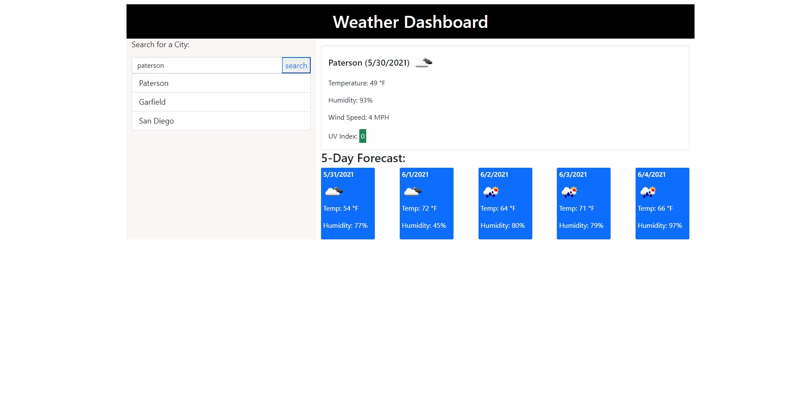

# Weather Dash-board
1. [ Description. ](#description)
2. [ Web Address. ](#web-address)

## 1. Description

### This is a Day planner created with Jquery, it uses CSS, bootstrap, and moment.js to capture time. It integrates a third party API with OpenWeather."add

This application is to see the current weather and the 5 day forecast for the city that is searched

Desktop screen:

## 2. How to Get There

### Open your web browser and enter the following web address to access.

https://jaimevilches87.github.io/work-day-planner/